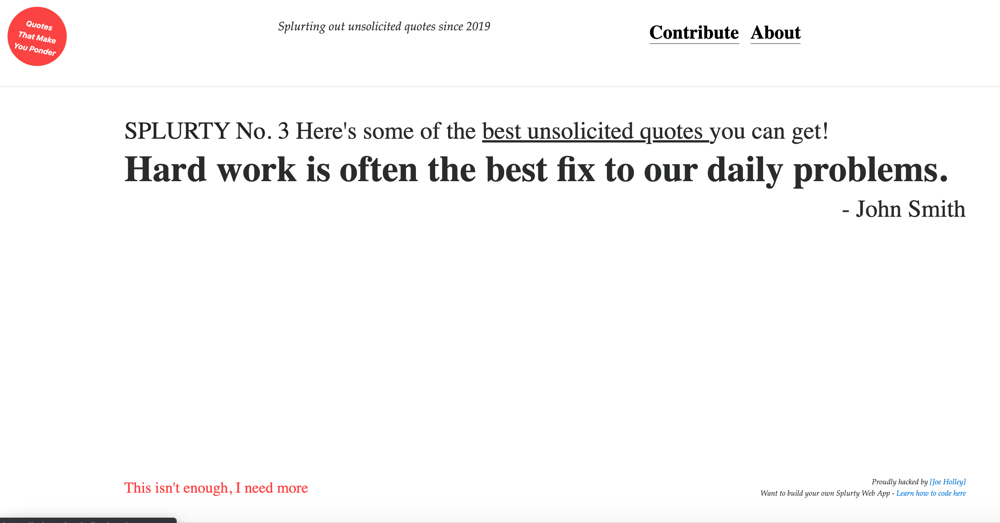

# README

A database-powered quote generator with a mobile-first design, using the Ruby framework, HTML, and CSS. Uses Git and Github for version control, and launched on Heroku.

Built using:
- Ruby v2.5.3
- HTML5
- CSS
- Bootstrap 4.0.0.alpha6
- JQuery
- Popper JS
- Font Awesome

https://splurty-joe-holley.herokuapp.com/
